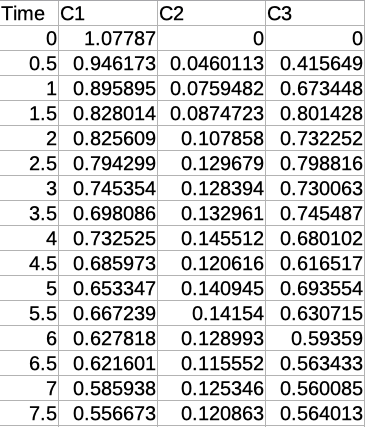
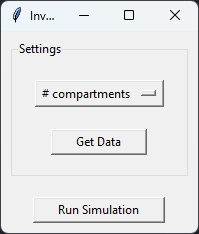
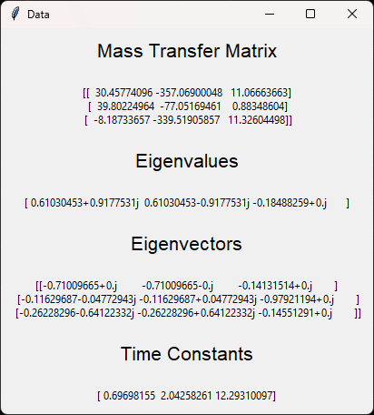
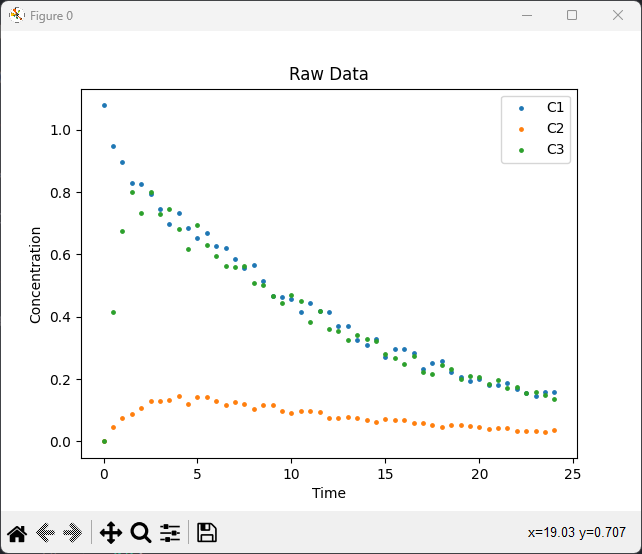
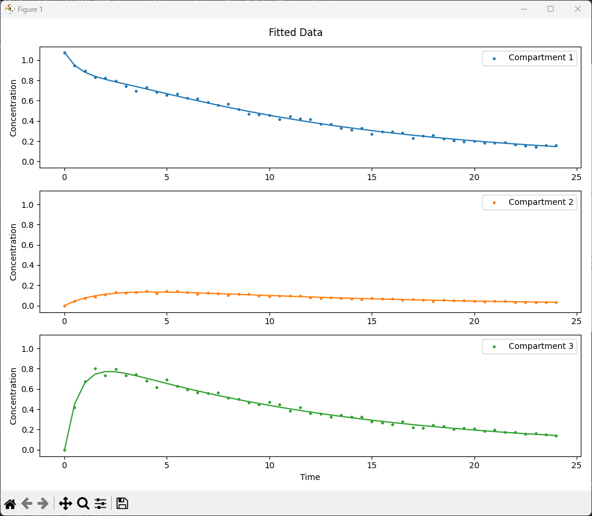

# Inverse Pk Calculator
Compartment ODE solver is a tool focused on solving molecule transfer between compartments problems that are part of the University of Utah BME 4001 - BioTransport class. In using this tool, known data can be entered to create a concentration vs. time plot and solve for additional data values. This program uses trendline fitting for each compartment's data simultaneously in the form:

$$ C(t) = \sum_{i=1}^{N} \sum_{j=1}^{N} a_{ij} e^{-t/\tau_j} $$

Required Modules:
<br/>

[](https://numpy.org/)
[](https://scipy.org/)
[](https://pandas.pydata.org)
[](https://matplotlib.org/)
[](https://docs.python.org/3/library/tkinter.html)

## Usage

### Terminal

Launch python program from ther terminal with:

```
python InversePk.py
```

Terminal must be active in the same directory as the python program to launch.

### Windows

For windows users a compiled app is availible [here](https://github.com/BattlemasterLoL/InversePk/releases). The program may also be launched using ther terminal command above.

### Windows

For macOS users a compiled app is availible [here](https://github.com/BattlemasterLoL/InversePk/releases). The program may also be launched using ther terminal command above.

### Linux

For linux users a compiled app is not avalible and muse be lunched using there terminal outlined above.

## Documentation

After the program has been launced a window will open (this may take a few seconds to apear). The window consists of a settings section with a dropdown to select the number of comparmtnes and a button to choose the data file. This is then followed by the button Run Simulation.

### Number of Compartments
The dropdown for the number of compartments can be set to 2, 3, or 4 compartments. This number will be determined by the number of compartments in the data set to be used in the script.

### Select Data
The button named "Get Data" will then be pressed to select the .csv file containing the data to be used. This data must be in a csv file format with the first column being time. The columns must then be in order of assending compartments. All columns must have the titles of "Time", "C1", "C2", "C3", and "C4". 



## Example

|               <div style='width: 15em'></div>                |                                   |
| :------------------------------------------------: | :---------------------------------------------------: |
| <h3>Main Program</h3> | <h3>Data Window</h3> |
|  |  |
| <h3>Raw Plot</h3> | <h3>Fitted Plot</h3> |
|  |  |
